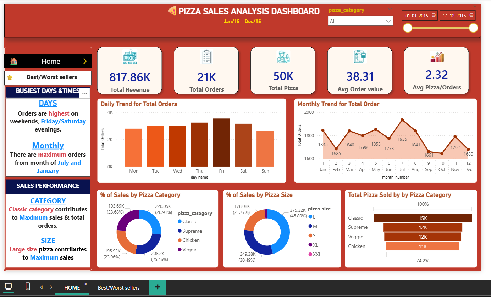
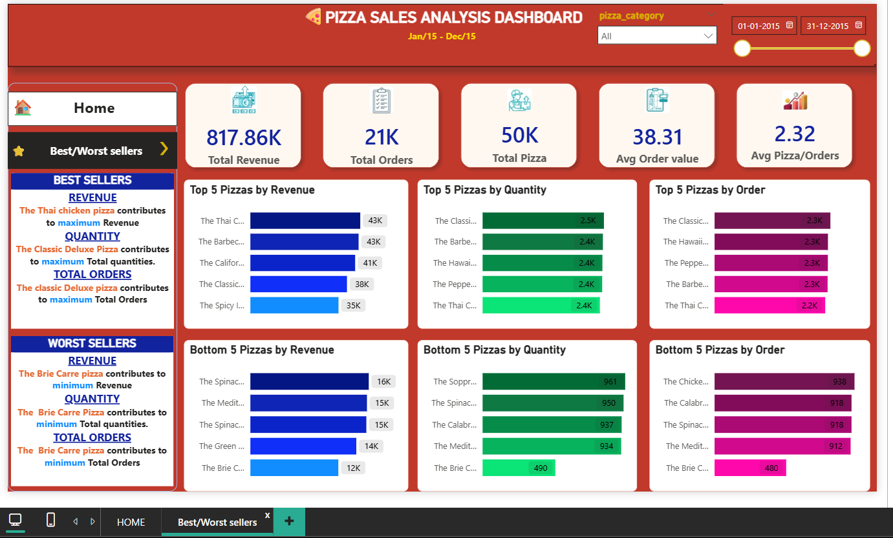

# 🍕 End-to-End Pizza Sales Analysis using Python, SQL & Power BI

## 📌 Project Overview

This project demonstrates an end-to-end data analytics workflow using **Python**, **SQL**, and **Power BI** to analyze pizza sales data. The objective is to transform raw sales data into meaningful business insights through data preprocessing, SQL-based KPI analysis, and interactive dashboards that support data-driven decision-making.

---

## 🎯 Business Objective

The objective of this project is to analyze pizza sales performance by answering key business questions such as:

- How much revenue was generated?
- How many orders and pizzas were sold?
- What is the average order value?
- Which pizza categories and sizes perform the best?
- Which days and months have the highest sales?
- Which pizzas are the best and worst sellers?

The dashboard was designed based on the required KPIs and visualization requirements. 

---

# 🛠️ Tools & Technologies

- **Python** (Pandas, NumPy)
- **SQL Server**
- **Power BI**

---

# 📂 Dataset

The dataset contains transactional pizza sales information, including:

- Order ID
- Order Date
- Order Time
- Pizza Name
- Pizza Category
- Pizza Size
- Quantity
- Unit Price
- Total Price

---

# 🔄 Project Workflow

### 1. Data Collection
- Imported pizza sales dataset (.csv)

### 2. Data Cleaning & Preprocessing (Python)
- Loaded dataset using Pandas
- Checked for missing values
- Removed duplicate records
- Corrected data types
- Prepared the dataset for analysis

### 3. SQL Analysis
Calculated business KPIs using SQL:
- Total Revenue
- Total Orders
- Total Pizzas Sold
- Average Order Value
- Average Pizzas per Order
- Daily Sales Trend
- Monthly Sales Trend
- Sales by Category
- Sales by Size
- Top 5 Best Sellers
- Bottom 5 Worst Sellers

### 4. Power BI Dashboard Development
Created an interactive dashboard using:
- KPI Cards
- Bar Charts
- Line Chart
- Donut Charts
- Funnel Chart
- Slicers

### 5. Business Insights
Generated meaningful insights to support business decision-making.

---

# 📊 Dashboard Overview

## 🏠 Home Dashboard

### KPIs
- Total Revenue
- Total Orders
- Total Pizzas Sold
- Average Order Value
- Average Pizzas per Order

### Visualizations
- Daily Trend for Total Orders
- Monthly Trend for Total Orders
- Percentage of Sales by Pizza Category
- Percentage of Sales by Pizza Size
- Total Pizza Sold by Category

### Business Insights
- Highest sales occur on **Friday and Saturday evenings**.
- Maximum monthly orders were recorded in **July** and **January**.
- **Classic** pizza category contributes the highest sales and total orders.
- **Large** size pizzas generate the highest sales.

---

## ⭐ Best & Worst Sellers Dashboard

### Top 5 Pizzas by
- Revenue
- Quantity Sold
- Total Orders

### Bottom 5 Pizzas by
- Revenue
- Quantity Sold
- Total Orders

### Key Findings
- **Thai Chicken Pizza** generated the highest revenue.
- **Classic Deluxe Pizza** recorded the highest quantity sold and total orders.
- **Brie Carre Pizza** generated the lowest revenue, quantity sold, and total orders.

---

# 📷 Dashboard Preview

## Home Dashboard



---

## Best & Worst Sellers Dashboard



---

# 📈 Key Performance Indicators

| KPI | Value |
|------|-------|
| Total Revenue | **817.86K** |
| Total Orders | **21K** |
| Total Pizzas Sold | **50K** |
| Average Order Value | **38.31** |
| Average Pizzas per Order | **2.32** |

---

# 💡 Key Business Insights

- Generated approximately **817.86K** in total revenue.
- Processed over **21K** customer orders.
- Sold nearly **50K** pizzas.
- Peak sales occurred on **Friday and Saturday evenings**.
- **July** recorded the highest monthly sales.
- **Classic** category was the top-performing pizza category.
- **Large-sized** pizzas contributed the highest sales.
- Thai Chicken Pizza was the highest revenue-generating pizza.
- Brie Carre Pizza was the lowest-performing pizza.

---

# 📁 Repository Structure

```
Pizza-Sales-Analysis/
│
├── Dataset/
│   └── pizza_sales.csv
│
├── Python/
│   └── pizza_sales.ipynb
│
├── SQL Queries/
│   └── Pizza_Sales_SQL_Queries.sql
│
├── Dashboard/
│   └── Pizza_Sales_Dashboard.pbix
│
├── Images/
│   ├── Home_Dashboard.png
│   └── Best_Worst_Sellers.png
│
└── README.md
```

---

# 🚀 How to Run the Project

1. Clone this repository.
2. Open **pizza_sales.ipynb** and run the notebook for data preprocessing.
3. Import the cleaned dataset into SQL Server.
4. Execute **Pizza_Sales_SQL_Queries.sql** to calculate KPIs.
5. Open **Pizza_Sales_Dashboard.pbix** in Power BI Desktop.
6. Refresh the data and explore the interactive dashboard.

---

# 📚 Skills Demonstrated

- Data Cleaning
- Data Preprocessing
- Exploratory Data Analysis (EDA)
- SQL Query Writing
- KPI Development
- Dashboard Design
- Data Visualization
- Business Intelligence
- Business Insight Generation

---

## 👨‍💻 Author

**Pranav E**

Aspiring Data Analyst

**Skills**

- Python
- SQL
- PostgreSQL
- Power BI
- Data Analysis
- Data Visualization

### Connect with Me
- GitHub: https://github.com/pranavv-e
- LinkedIn: https://www.linkedin.com/in/pranav-e-b38434381
